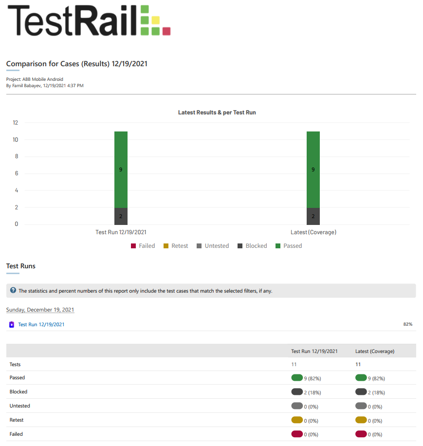

# User Acceptance Test (UAT) Report

#### Details of the Application
* Name: ABB Mobile
* Version: 3.14.5

#### I tried to test the following functionalities:
* Registration
* OTP process
* Login
* Password change
* PIN (access code of application) change
* PIN reset
* Payment to mobile operator

##### Findings & Output

Out of all 11 test, 9 of them passed and the 2 - Password change and PIN change failed because, these functionalities were not available and missing.